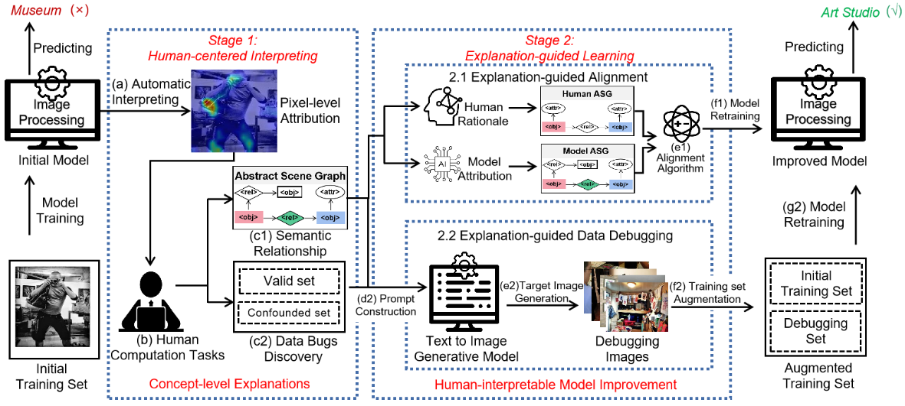

# Semantic-aware Attribution Analysis: A Human-in-the-Loop Framework for Interpreting and Improving Image Understanding.

This repository contains PyTorch implementation of our paper [SA³:Semantic-aware Attribution Analysis: A Human-in-the-Loop Framework for Interpreting and Improving Image Understanding]().



## EGDD

* Our EGDD module is a modification on the [MAE repo](https://github.com/facebookresearch/mae). Installation and preparation follow that repo.

### Fine-tune
```
OMP_NUM_THREADS=1 python -m torch.distributed.launch --nproc_per_node=4 --use_env main_finetune.py    
 --accum_iter 4     
 --batch_size 64
 --model vit_base_patch16     
 --epochs 100     
 --blr 5e-4 
 --layer_decay 0.65     
 --weight_decay 0.05 
 --drop_path 0.1 
 --mixup 0.8 
 --cutmix 1.0 
 --reprob 0.25  
 --data_path ./places365/generated_based_12_prompt_with_concept_debugset/    
 --output_dir ./12_sub_classes_prompt_with_concept_based_output_dir    
 --log_dir ./12_sub_classes_prompt_with_concept_based_output_dir   
 --dist_eval
```

The following table provides the fine-tuned checkpoints used in the paper:
<table><tbody>
<!-- START TABLE -->
<!-- TABLE HEADER -->
<th valign="bottom">Debug-Train method\checkpoints</th>
<th valign="bottom">Checkpoints</th>

<!-- TABLE BODY -->
<tr><td align="left">S-Random</td>
<td align="center"><a href="https://drive.google.com/drive/folders/14T2EqYXCLUAPheIUHm9VFZdxLzduN45I">download</a></td>
</tr>
<tr><td align="left">S-Similarity</td>
<td align="center"><a href="https://drive.google.com/drive/folders/1zhV-jg0qjHDfLyFFn_458dIfHRwBWuqP">download</a></td>

</tr>
<tr><td align="left">S-Active Learning</td>
<td align="center"><a href="https://drive.google.com/drive/folders/1sxSpsx2gQVA0Mdh4IaJgvcoXXdXaF_Su">download</a></td>

</tr>
<tr><td align="left">G-LLM</td>
<td align="center"><a href="https://drive.google.com/drive/folders/1WCyXBOGMomnKLYAT7HB9qxc8yOl6vJlA">download</a></td>
</tr>
<tr><td align="left">G-TG</td>
<td align="center"><a href="https://drive.google.com/drive/folders/1wTDmIKg2361E5j6IaYL0AR-8g257NvzQ">download</a></td>
</tr>
<tr><td align="left">G-LLM-prompt</td>
<td align="center"><a href="https://drive.google.com/drive/folders/1QSr7l7UXQYda7oJT6I6dbgWzOfLRGKZD">download</a></td>
</tr>
<tr><td align="left">Ours</td>
<td align="center"><a href="https://drive.google.com/drive/folders/1jf57OVnTaTEkI7icSU9FVBDT9zHeSCfX">download</a></td>
</tr>

</tbody></table>

### Datasets

All datasets will be released soon.

## EGA

### Prerequisites

```
cd EGA
export PYTHONPATH=$(pwd):${PYTHONPATH}
```

Create conda environment and install dependencies using `requirements.txt` file:

```
conda create -n ENV_NAME python>=3.6
conda activate ENV_NAME
pip install -r requirements.txt
```

### Training & Inference
```
cd exguidedimcap/train

# setup config files
# you should modify data paths in configs/prepare_coco_imgsg_config.py
python configs/prepare_coco_imgsg_config.py 
resdir='' # copy the output string of the previous step

# training
python ega2caption.py $resdir/model.json $resdir/path.json --eval_loss --is_train --num_workers 8

# inference(EGA)
python ega2caption.py $resdir/model.json $resdir/path.json --eval_set val_sub --num_workers 8

# inference(EGDD+EGA)
python ega2caption.py $resdir/model.json $resdir/path.json --eval_set val_sub_opt --num_workers 8
```

### Datasets

All datasets can be download from [GoogleDrive](https://drive.google.com/drive/folders/1IXjhFePGt9iWDBsPnBbLWRXXKRfeW__C?usp=sharing)

#### Model ASG Annotations

Model ASG Annotations are annotated by crowed workers in the platform `ScaleAI`.
Annotation results(part) are in `tasks.json` file. (Note:Due to privacy concerns, we have only open-sourced partial annotation results.)
#### Human ASG Annotations(sampled from MSCOCO)
##### Annotation

- Human ASG annotations: regionfiles directory

```
JSON Format:
{
	"region_id": {
		"objects":[
			{
	     		"object_id": int, 
	     		"name": str, 
	     		"attributes": [str],
				"x": int,
				"y": int, 
				"w": int, 
				"h": int
			}],
  	  "relationships": [
			{
				"relationship_id": int,
				"subject_id": int,
				"object_id": int,
				"name": str
			}],
  	  "phrase": str,
  }
}
```

- vocabularies
int2word.npy: [word]
word2int.json: {word: int}

- data splits: public_split directory
trn_names.npy, val_names.npy, val_sub_names.npy val_sub_opt_names.npy

##### Features
Global and Region Image Features for MSCOCO.

- Global Image Feature(MP directory): the last mean pooling feature of [ResNet101 pretrained on ImageNet](https://pytorch.org/vision/stable/models.html#table-of-all-available-classification-weights)

format: npy array, shape=(num_fts, dim_ft)
corresponding to the order in data_split names

- Region Image Feature(SA directroy): fc7 layer of [Faster-RCNN pretrained on VisualGenome](https://github.com/cshizhe/maskrcnn_benchmark)

format: hdf5 files, "image_id".jpg.hdf5

  key: 'image_id'.jpg
  
  attrs: {"image_w": int, "image_h": int, "boxes": 4d array (x1, y1, x2, y2)}


